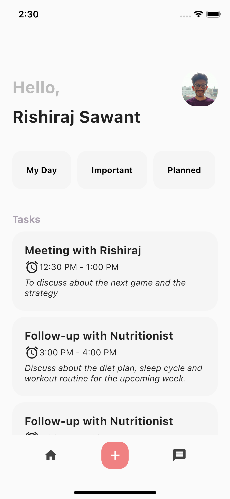
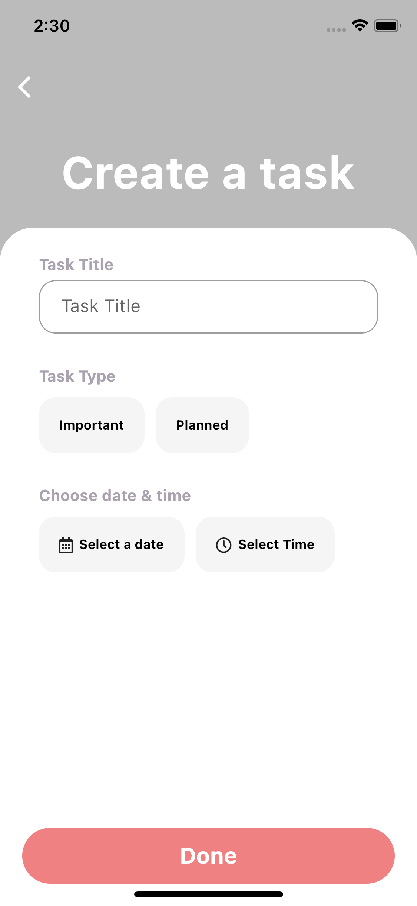

# task_manager

Flutter application to create/edit tasks to manage your daily life.

Inspired by design: <a href='https://dribbble.com/shots/12162589-Schedo-Task-Manager-App'>Schedo : Task Manager App</a> by <a href='https://dribbble.com/dsamivai'>Abdur Rahman Sami</a>

Tried to mock the UI as per the design:

1. Home Screen

2. Create Task Screen

